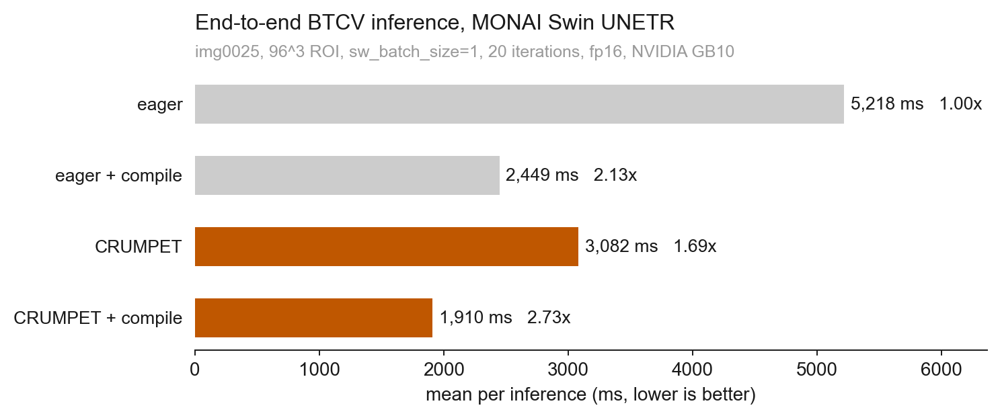

# CRUMPET: fused 3D shifted-window kernels for efficient transformers

CRUMPET (CUDA accelerated Roll, Unpartition, Mask and Partition for Efficient Transformers) is a CUDA + Triton kernel package for the shifted-window mechanics and window-attention compute used by 3D Swin models, especially MONAI Swin UNETR. It fuses cyclic roll, window partition, window reverse, reverse roll, shifted attention mask construction and the window-attention scaled-dot-product compute into a small set of GPU kernels, reducing avoidable memory traffic and launch overhead in volumetric transformer workloads. The package is designed to operate as a Hugging Face Kernel, i.e. it is forward-only.

## What is CRUMPET?

Crumpet is a kernel targeting tensors of the form `[B, D, H, W, C]` in the shifted-window mechanics inside 3D Swin models. It includes a Triton FlashAttention2 fused window-attention kernel that replaces the eager `q @ k.T + bias + mask -> softmax -> attn @ v` chain.

## Why this exists (and why you should care)

MONAI's Swin-UNETR and related models spend time outside attention proper on `torch.roll`, window partition, window reverse and shifted attention mask construction; inside attention they materialise a `[B, num_heads, N, N]` scores tensor several times for the bias and mask adds. Both classes of cost are memory-bandwidth bound rather than tensor-core bound, and standard libraries don't fuse them. CRUMPET ships hand-tuned kernels for the partition/unpartition/mask mechanics and a Triton fused window-attention kernel. The supplied MONAI patch swaps them in transparently.

## Install and load from Kernel Hub

```python
from kernels import get_kernel

crumpet = get_kernel("chrisvoncsefalvay/crumpet")
```

For local development:

```bash
PYTHONPATH=torch-ext python -c "import crumpet; print(crumpet.__version__)"
```

## Quickstart

```python
import torch
import crumpet

x = torch.randn((1, 98, 98, 98, 48), device="cuda", dtype=torch.float16)
windows = crumpet.fused_shift_partition_3d(x, (7, 7, 7), (3, 3, 3))
restored = crumpet.fused_unshift_unpartition_3d(
    windows, 1, 98, 98, 98, 48, (7, 7, 7), (3, 3, 3)
)
mask = crumpet.compute_attn_mask_3d(
    98, 98, 98, (7, 7, 7), (3, 3, 3), torch.float16, "cuda"
)
```

## Raw API

Raw dispatcher ops accept preallocated outputs and are used by the Python wrappers:

```python
compute_attn_mask_3d(output, D, H, W, ws_d, ws_h, ws_w, ss_d, ss_h, ss_w)
fused_shift_partition_3d(output, x, ws_d, ws_h, ws_w, ss_d, ss_h, ss_w)
fused_unshift_unpartition_3d(output, windows, B, D, H, W, C, ws_d, ws_h, ws_w, ss_d, ss_h, ss_w)
```

## High-level API

```python
mask = crumpet.compute_attn_mask_3d(
    D=96,
    H=96,
    W=96,
    window_size=(4, 4, 4),
    shift_size=(2, 2, 2),
    dtype=torch.float16,
    device="cuda",
)

windows = crumpet.fused_shift_partition_3d(
    x,
    window_size=(7, 7, 7),
    shift_size=(3, 3, 3),
)

x_restored = crumpet.fused_unshift_unpartition_3d(
    windows,
    B=1,
    D=98,
    H=98,
    W=98,
    C=48,
    window_size=(7, 7, 7),
    shift_size=(3, 3, 3),
)
```

## MONAI monkeypatch

```python
import crumpet

crumpet.patch_monai_swin_unetr()
# run MONAI Swin UNETR
crumpet.unpatch_monai_swin_unetr()
```

The raw kernels require `D`, `H` and `W` to be divisible by `window_size`. The monkeypatch (monaipatch?) preserves MONAI semantics: it pads inside the Swin block, calls CRUMPET on padded dimensions and crops back to the original shape.

## Swin UNETR on BTCV

Real run:

```bash
PYTHONPATH=torch-ext python -m crumpet.demo_btcv \
  --bundle-dir ./bundles/swin_unetr_btcv_segmentation \
  --image ./data/btcv_case.nii.gz \
  --device cuda \
  --dtype fp16 \
  --roi-size 96 96 96 \
  --sw-batch-size 1 \
  --warmup 5 \
  --iters 20 \
  --output-json benchmarks/results/btcv_bundle_demo.json
```

If `--label` is supplied, the demo computes Dice scores for baseline and patched outputs. If `--image` is omitted, the command runs a synthetic smoke test and writes `"synthetic": true`.

## Benchmarks

Measured on NVIDIA GB10, PyTorch 2.10.0+cu130, Triton 3.6, CUDA 13.0, fp16.


### End-to-end real BTCV inference

`img0025`, MONAI Swin UNETR bundle and the MONAI `swin_unetr_btcv_segmentation` trained checkpoint, 96^3 ROI, 20 iterations:



| Path | Mean per inference | vs baseline |
| --- | ---: | ---: |
| Eager PyTorch | 5218 ms | 1.00x |
| Eager + `--compile` | 2449 ms | 2.13x |
| **CRUMPET patched** | 3082 ms | **1.69x** |
| **CRUMPET patched + `--compile`** | **1910 ms** | **2.73x** |

Per-kernel speedups vs the eager reference (BTCV-shape, fp16):

| Kernel | Speedup |
| --- | ---: |
| `fused_shift_partition_3d` (BTCV stage 0) | 2.90x |
| `fused_unshift_unpartition_3d` (BTCV stage 0) | 2.74x |
| `compute_attn_mask_3d` (D=98) | 22.4x |
| `fused_swin_attention` (BTCV stage 0) | 7.4x |

Saved Dice acore on the reference label is within fp16 noise (`baseline 0.16146 -> patched 0.16144`, delta=-2.5e-5).

Result JSON files from individual benchmark runs land in `benchmarks/results/`; cf. `bench_kernel.py`, `bench_e2e.py` and `bench_btcv_bundle.py` for the entry points.

## Limitations

- NVIDIA CUDA only for now. Is anybody doing MONAI on Metal?
- Channels-last spatial layout, please: `[B, D, H, W, C]`.
- Standalone kernels require padded dimensions; the MONAI patch handles the padding internally.
- The fused window-attention kernel needs `head_dim >= 16` (Triton `tl.dot` constraint). MONAI Swin UNETR's BTCV bundle uses `head_dim = 16`; the patch falls back to the eager path for smaller head dims.
- The fused window-attention kernel runs only at inference. This is intentional, it's part of the Hugging Face kernels philosophy, and I'm not going to change it. The patched `WindowAttention.forward` falls back to the eager path during training and when `attn_drop > 0`.
- Shape changes across calls are supported through cache keys; dynamic shapes inside one compiled graph are not promised.

## Development

```bash
PYTHONPATH=torch-ext python -m pytest tests -q
PYTHONPATH=torch-ext python benchmarks/bench_kernel.py --dtype fp16
```

Environment variables:

```text
CRUMPET_ENABLE_NVTX=1
CRUMPET_DEBUG=1
CRUMPET_FORCE_REFERENCE=1
CRUMPET_DISABLE_MASK_CACHE=1
CRUMPET_MASK_CACHE_SIZE=64
CRUMPET_MASK_CACHE_MAX_BYTES=1073741824
CRUMPET_BLOCK_C=64
CRUMPET_BLOCK_LOCAL=343
```


## Profiling

```bash
bash benchmarks/profile_kernel.sh
bash benchmarks/profile_baseline.sh
python benchmarks/profile_summary.py
```

Nsight Systems profiling was run on DGX Spark. Shifted fp16 kernels measured about
0.142 ms for `shift_partition_kernel` and 0.114 ms for
`unshift_unpartition_kernel` on the profiled case. First uncached dense mask
construction is dominated by CUDA memset, about 3.30 ms versus about 0.72 ms in
the mask kernel; the mask cache makes repeated calls about 0.008 ms in the event
benchmark.

## Citation

If you use CRUMPET, please cite:

```bibtex
@misc{crumpet2026,
  title        = {CRUMPET: fused 3D shifted-window kernels for efficient transformers},
  author       = {von Csefalvay, Chris},
  year         = {2026},
  howpublished = {\url{https://huggingface.co/chrisvoncsefalvay/crumpet}}
}
```

CRUMPET follows the shifted-window mechanics described by Liu et al. 2021 for Swin Transformer and the 3D Swin UNETR implementation by Hatamizadeh et al. 2022. Microsoft Swin Transformer provides 2D fused window-process CUDA prior art.

## Medical-use disclaimer

CRUMPET is an optimisation package. It is not a diagnostic medical device and is not intended for clinical decision-making.

## Author

I'm [Chris von Csefalvay](https://chrisvoncsefalvay.com), an AI researcher specialising in post-training, and the author of _[Post-Training: A Practical Guide for AI Engineers and Developers](https://posttraining.guide)_ (No Starch Press, 2026). I also write [Post-Slop](https://postslop.substack.com), a periodic diatribe about AI, and what it's doing for society. You can also find me on [LinkedIn](https://linkedin.com/in/chrisvoncsefalvay) and [X](https://x.com/epichrisis).

## License

MIT. See [LICENSE](LICENSE) in the repository.
